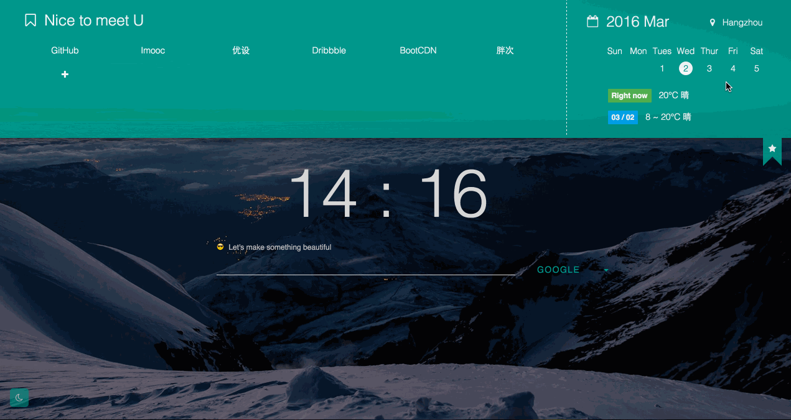

# [DonutTab](https://chrome.google.com/webstore/detail/donuttab/dhidagleggfbfandlmbbifflkolokomg)

Chrome extension for new tab Based on ES6, React, Webpack

### Install from Chrome Webstore

[DonutTab](https://chrome.google.com/webstore/detail/donuttab/dhidagleggfbfandlmbbifflkolokomg)

### Preview

### USAGE

- Select Theme to match the background image

- Search Something

- Open the Tool

- Edit the Bookmark

- Check the Weather

### Development

	// 安装依赖
	npm install  

	// 调试 http://localhost:8080/webpack-dev-server/
	npm run dev 
	
	// 编译
	npm run build